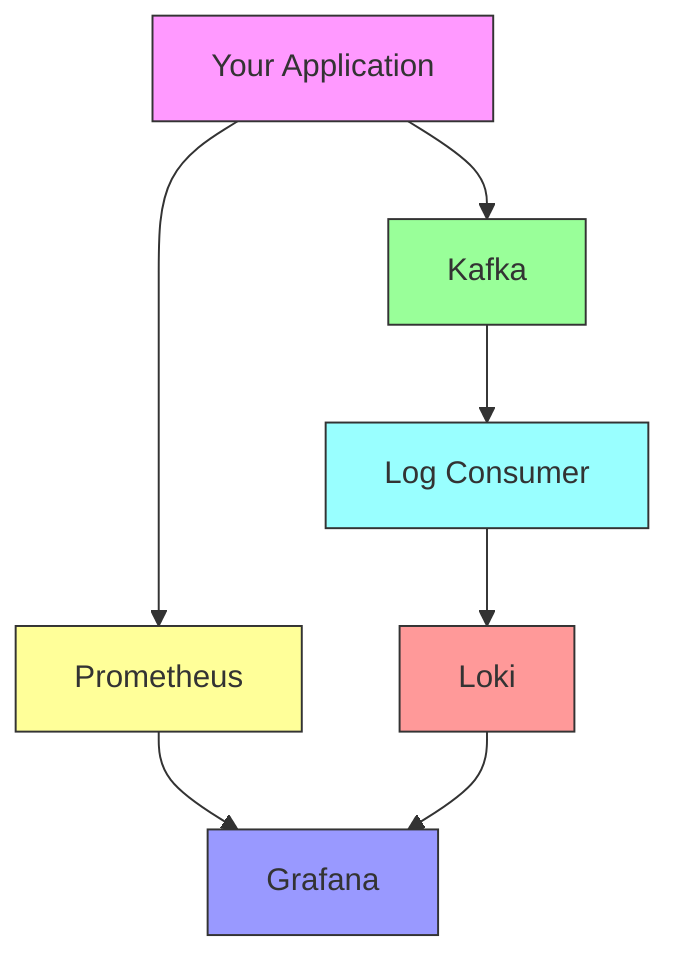
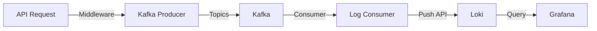
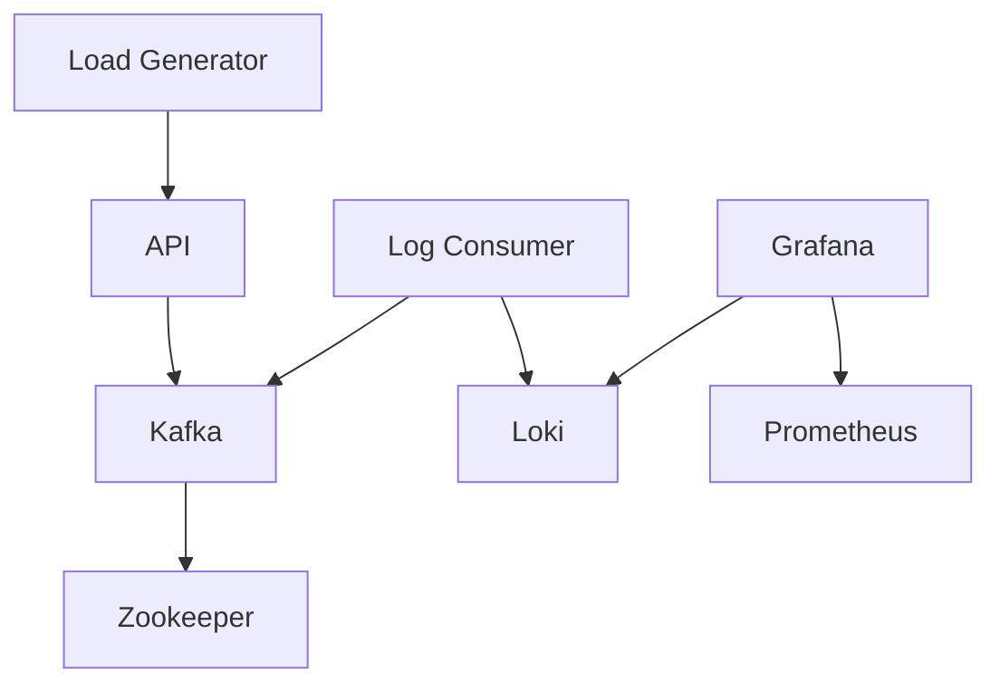

# Application Monitoring System Documentation

## 1. System Overview

The Application Monitoring System is a comprehensive solution that provides real-time monitoring, logging, and observability for a REST API service. It combines modern tools and practices to deliver insights into application performance, request patterns, and system health.

### Key Features
- Real-time API request monitoring
- Centralized logging system
- Performance metrics collection
- Interactive dashboards
- Load testing capabilities

## 2. Understanding Core Monitoring Components (Beginner's Guide)

### What is Prometheus?
Prometheus is an open-source monitoring system that helps you collect and store numerical data about your application's performance over time. Think of it like a smart security camera for your application that:
- Records numbers (metrics) about your application every few seconds
- Stores these numbers in a specialized database
- Lets you query these numbers to understand what's happening

#### Key Concepts for Beginners:
1. **Metrics**: Numbers that tell you about your application
   - Example: How many users are logged in right now?
   - Example: How long does each request take?

2. **Scraping**: How Prometheus collects data
   - Every 15 seconds (by default), Prometheus visits your application
   - Your application provides numbers at a special URL (usually /metrics)
   - Prometheus saves these numbers with timestamps

3. **Simple Query Example**:
   ```promql
   # Count of API requests in the last hour:
   http_requests_total[1h]
   
   # Average response time of the last 5 minutes:
   rate(http_request_duration_seconds_sum[5m])
   ```

### What is Loki?
Loki is like a search engine for your application's logs. While Prometheus handles numbers, Loki handles text logs. It's designed to be:
- Cost-effective (stores less data than traditional systems)
- Easy to run
- Perfect for container environments like Docker

#### Key Concepts for Beginners:
1. **Log Streams**: Collections of log messages from the same source
   - Example: All logs from your API server
   - Example: All error messages from your database

2. **Labels**: Tags that help organize and find logs
   - Example: `{service="api", environment="production"}`

3. **Simple Query Example**:
   ```logql
   # Find all error logs from the API:
   {service="api"} |= "error"
   
   # Find slow requests:
   {service="api"} |= "request took" |> "1000ms"
   ```

### What is Grafana?
Grafana is like a dashboard in your car - it shows you important information about your system in real-time. It can:
- Display graphs and charts
- Show logs
- Send alerts when something goes wrong
- Combine data from both Prometheus and Loki

#### Key Features for Beginners:
1. **Dashboards**: Collections of graphs and visualizations
   - Start with pre-built dashboards
   - Customize them as you learn more

2. **Panels**: Individual graphs or displays
   - Line graphs for metrics over time
   - Lists for viewing logs
   - Stats panels for current values

3. **Basic Navigation**:
   - Left sidebar: Access dashboards and data sources
   - Top bar: Time range selection
   - Panel controls: Zoom, export, etc.

### What is Kafka?
Kafka is like a super-powered message queue system. Imagine it as a smart post office that:
- Never loses messages
- Can handle millions of messages per second
- Keeps messages organized by topics
- Let's multiple applications send and receive messages

#### Key Concepts for Beginners:
1. **Topics**: Categories for messages
   - Example: All logs go to an "api-logs" topic
   - Example: All error messages go to an "errors" topic

2. **Producers**: Applications that send messages
   - In our system: The API service sends logs

3. **Consumers**: Applications that read messages
   - In our system: The log consumer that sends to Loki

### How They All Work Together


In this system:
1. Your application produces both metrics and logs
2. Prometheus collects the metrics (numbers)
3. Kafka receives and stores the logs (text)
4. The Log Consumer forwards logs from Kafka to Loki
5. Grafana displays everything in nice dashboards

This setup gives you:
- Real-time performance monitoring (Prometheus)
- Centralized logging (Loki via Kafka)
- Beautiful visualizations (Grafana)

## 3. Architecture Components

### FastAPI Application
Prometheus is an open-source monitoring system that helps you collect and store numerical data about your application's performance over time. Think of it like a smart security camera for your application that:
- Records numbers (metrics) about your application every few seconds
- Stores these numbers in a specialized database
- Lets you query these numbers to understand what's happening

#### Key Concepts for Beginners:
1. **Metrics**: Numbers that tell you about your application
   - Example: How many users are logged in right now?
   - Example: How long does each request take?

2. **Scraping**: How Prometheus collects data
   - Every 15 seconds (by default), Prometheus visits your application
   - Your application provides numbers at a special URL (usually /metrics)
   - Prometheus saves these numbers with timestamps

3. **Simple Query Example**:
   ```promql
   # Count of API requests in the last hour:
   http_requests_total[1h]
   
   # Average response time of the last 5 minutes:
   rate(http_request_duration_seconds_sum[5m])
   ```

### What is Loki?
Loki is like a search engine for your application's logs. While Prometheus handles numbers, Loki handles text logs. It's designed to be:
- Cost-effective (stores less data than traditional systems)
- Easy to run
- Perfect for container environments like Docker

#### Key Concepts for Beginners:
1. **Log Streams**: Collections of log messages from the same source
   - Example: All logs from your API server
   - Example: All error messages from your database

2. **Labels**: Tags that help organize and find logs
   - Example: `{service="api", environment="production"}`

3. **Simple Query Example**:
   ```logql
   # Find all error logs from the API:
   {service="api"} |= "error"
   
   # Find slow requests:
   {service="api"} |= "request took" |> "1000ms"
   ```

### What is Grafana?
Grafana is like a dashboard in your car - it shows you important information about your system in real-time. It can:
- Display graphs and charts
- Show logs
- Send alerts when something goes wrong
- Combine data from both Prometheus and Loki

#### Key Features for Beginners:
1. **Dashboards**: Collections of graphs and visualizations
   - Start with pre-built dashboards
   - Customize them as you learn more

2. **Panels**: Individual graphs or displays
   - Line graphs for metrics over time
   - Lists for viewing logs
   - Stats panels for current values

3. **Basic Navigation**:
   - Left sidebar: Access dashboards and data sources
   - Top bar: Time range selection
   - Panel controls: Zoom, export, etc.

### What is Kafka?
Kafka is like a super-powered message queue system. Imagine it as a smart post office that:
- Never loses messages
- Can handle millions of messages per second
- Keeps messages organized by topics
- Let's multiple applications send and receive messages

#### Key Concepts for Beginners:
1. **Topics**: Categories for messages
   - Example: All logs go to an "api-logs" topic
   - Example: All error messages go to an "errors" topic

2. **Producers**: Applications that send messages
   - In our system: The API service sends logs

3. **Consumers**: Applications that read messages
   - In our system: The log consumer that sends to Loki

### How They All Work Together


In this system:
1. Your application produces both metrics and logs
2. Prometheus collects the metrics (numbers)
3. Kafka receives and stores the logs (text)
4. The Log Consumer forwards logs from Kafka to Loki
5. Grafana displays everything in nice dashboards

This setup gives you:
- Real-time performance monitoring (Prometheus)
- Centralized logging (Loki via Kafka)
- Beautiful visualizations (Grafana)


## 4. Core Services

### FastAPI Application
- Core REST API service handling user, product, and order management
- Built with Python FastAPI framework
- Includes middleware for metrics collection
- In-memory storage (configured for demo purposes)

### Message Queue (Kafka)
- Message broker for log aggregation
- Topics structured as `api-logs-{log_type}`
- Ensures reliable log delivery
- Handles high-throughput logging

### Monitoring Stack
- **Prometheus**: Metrics collection and storage
- **Loki**: Log aggregation system
- **Grafana**: Visualization and dashboards

### API Service (FastAPI)
- **Location**: `src/api/main.py`
- **Features**:
  - RESTful endpoints for users, products, and orders
  - Request logging middleware
  - Prometheus metrics integration
  - Health check endpoint
- **Metrics Collected**:
  - Request count by method and endpoint
  - Request latency
  - Error rates

### Log Producer
- **Location**: `src/api/kafka_producer.py`
- **Purpose**: Sends application logs to Kafka
- **Features**:
  - Automatic timestamp addition
  - JSON serialization with datetime handling
  - Topic-based log routing
  - Error handling and retry logic

### Log Consumer
- **Location**: `src/api/kafka_consumer.py`
- **Purpose**: Processes logs from Kafka and forwards to Loki
- **Features**:
  - Subscribes to all api-logs topics
  - Formats logs for Loki ingestion
  - Reliable message processing
  - Error handling and recovery

### Load Generator
- **Location**: `src/api/load_generator.py`
- **Purpose**: Simulates API traffic for testing
- **Features**:
  - Configurable request rate
  - Mixed endpoint testing
  - Random data generation
  - Async request handling

## 5. Data Flow

### Request Flow
1. Client makes request to API
2. API middleware captures request metrics
3. Metrics sent to Prometheus
4. Request logs sent to Kafka
5. Log consumer processes messages
6. Logs forwarded to Loki
7. Grafana visualizes metrics and logs

### Log Flow


## 6. Monitoring & Observability

### Prometheus Configuration
- **Location**: `config/prometheus/prometheus.yml`
- **Scrape Interval**: 15s
- **Targets**:
  - API service (port 8000)
  - Prometheus itself

### Loki Configuration
- **Location**: `config/loki/local-config.yaml`
- **Features**:
  - Local storage mode
  - 7-day retention period
  - BoltDB indexing
  - In-memory ring

### Grafana Dashboard
- **Location**: `config/grafana/provisioning/dashboards/json/api_monitoring.json`
- **Panels**:
  1. Request Rate by HTTP Method
  2. Requests per Endpoint
  3. Error Rate (Non-2xx)
  4. Error Rate Percentage
  5. API Logs Stream

### Metrics Collected
- **Request Metrics**:
  ```python
  REQUEST_COUNT = Counter('http_requests_total', 'Total HTTP requests', ['method', 'endpoint', 'status'])
  REQUEST_LATENCY = Histogram('http_request_duration_seconds', 'HTTP request latency', ['method', 'endpoint'])
  ```

## 7. API Endpoints

### User Management
```
GET /users - List all users
GET /users/{user_id} - Get specific user
POST /users - Create new user
```

### Product Management
```
GET /products - List all products
GET /products/{product_id} - Get specific product
POST /products - Create new product
```

### Order Management
```
GET /orders - List all orders
GET /orders/{order_id} - Get specific order
POST /orders - Create new order
```

### System Endpoints
```
GET /health - Health check
GET /metrics - Prometheus metrics
GET /analytics - System statistics
```

## 8. Load Testing

### Configuration
- Default request rate: 10 requests/second
- Mixed endpoint testing
- Randomized data generation

### Test Scenarios
1. **Users**
   - Random user creation
   - User listing
   - Individual user retrieval

2. **Products**
   - Product creation with random data
   - Product listing
   - Individual product retrieval

3. **Orders**
   - Order creation with random products
   - Order listing
   - Individual order retrieval

### Sample Data
```python
SAMPLE_USERS = [
    {"username": f"user{i}", "email": f"user{i}@example.com"}
    for i in range(1, 6)
]

SAMPLE_PRODUCTS = [
    {
        "name": f"Product {i}",
        "price": random.uniform(10.0, 1000.0),
        "description": f"Description for product {i}",
        "stock": random.randint(1, 100)
    }
    for i in range(1, 6)
]
```

## 9. Deployment

### Docker Services
- All components containerized
- Internal network: `monitoring_network`
- Volume persistence for Prometheus and Grafana data

### Service Dependencies


### Access Points
- API: http://localhost:8000
- Grafana: http://localhost:3000
- Prometheus: http://localhost:9090
- Loki: http://localhost:3100

## 10. Best Practices

### Logging
- Structured JSON logging
- Consistent timestamp format
- Log level differentiation
- Contextual information inclusion

### Monitoring
- Real-time metrics collection
- Error rate tracking
- Latency monitoring
- Resource utilization tracking

### Security
- Grafana authentication
- Network isolation
- Service-specific ports
- Error handling without exposure

This documentation provides a comprehensive overview of the Application Monitoring System. For specific implementation details, refer to the source code in the respective directories.
